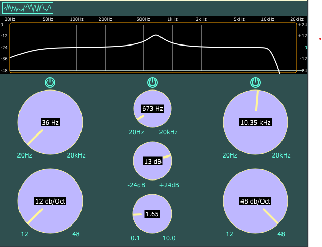

Audio plugin built, largely following this [excellent course](https://www.freecodecamp.org/news/learn-modern-cpp-by-building-an-audio-plugin/).

Built using the JUCE framework as an audio plugin for Projucer.

